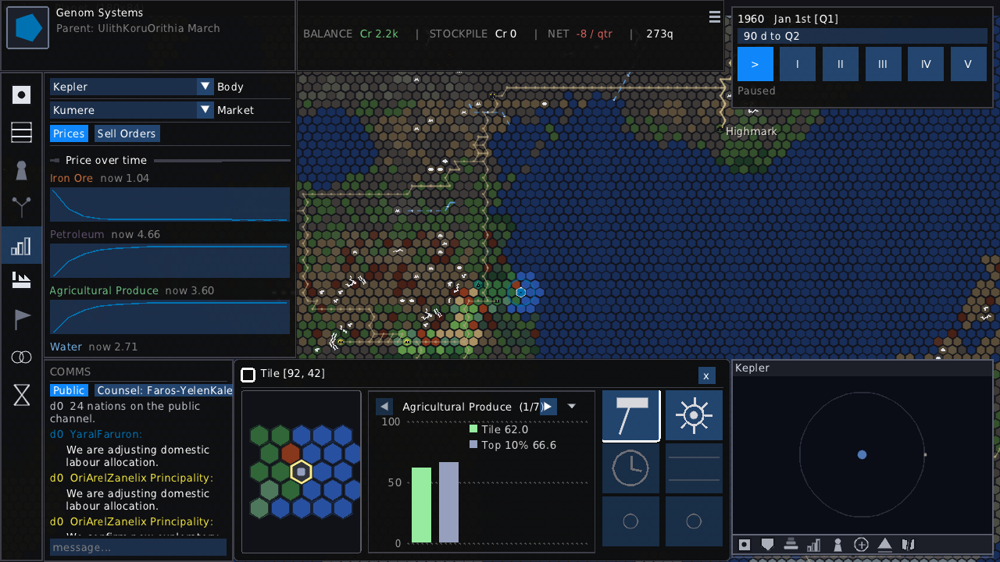
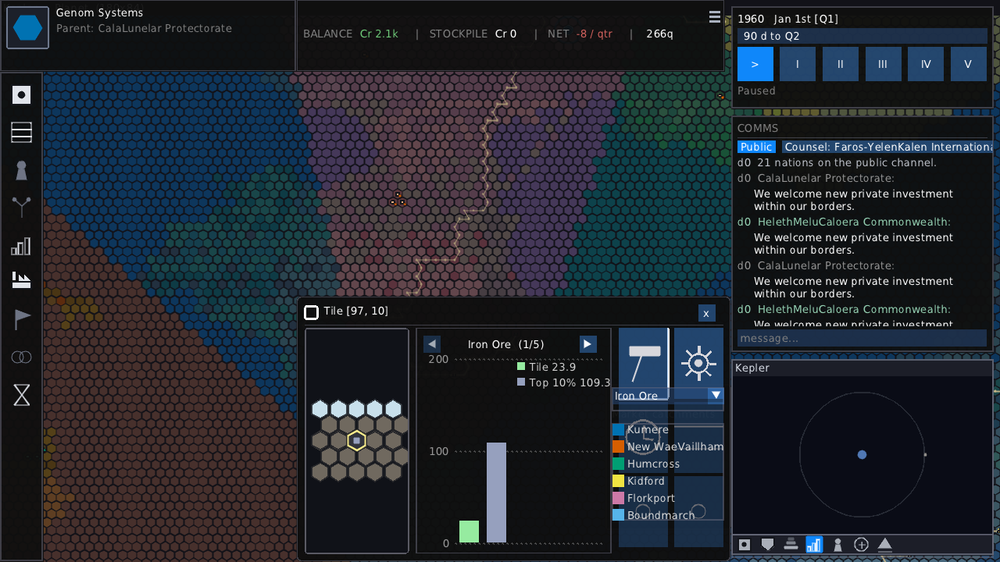
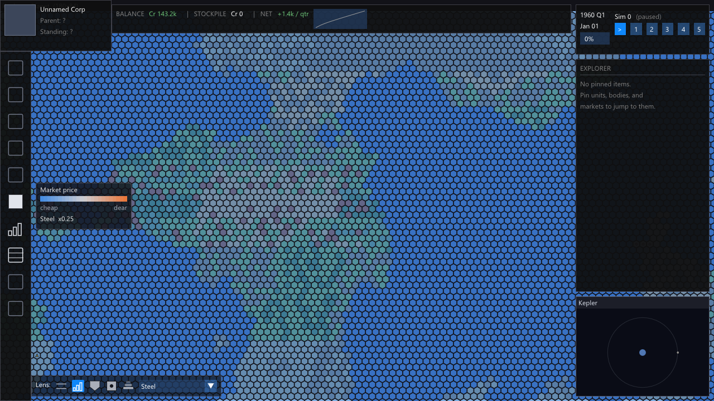
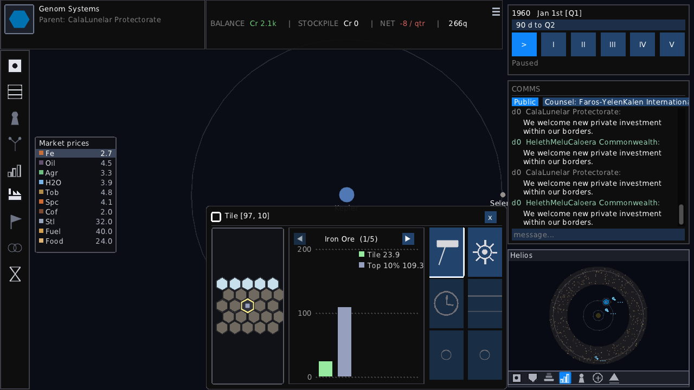
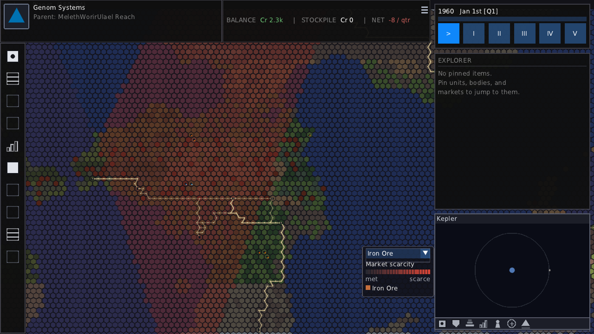
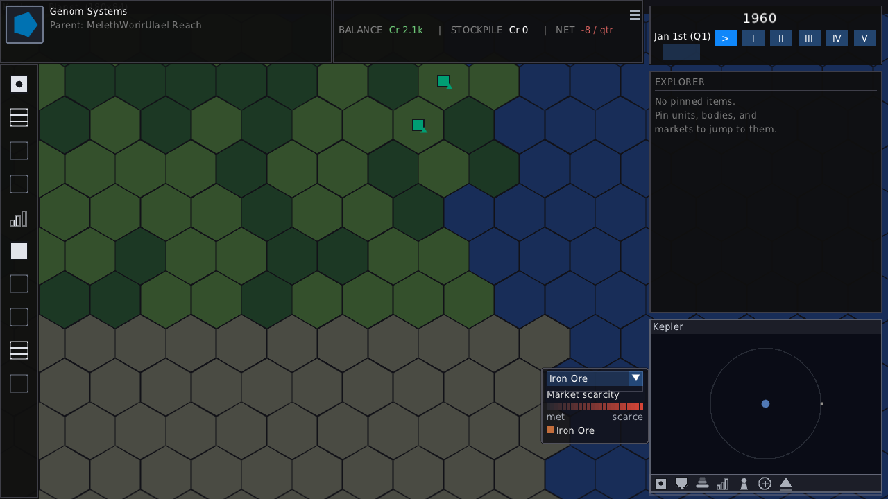

# v0.0.6 Delivery Report — Improved Core-Loop

*Session date: 2026-06-17. Six backlog items delivered across three commits.*

---

## What shipped

v0.0.6 deepened the economy layer that was scaffolded in earlier milestones. The six
items form a coherent vertical slice: the world now has a saturated economic backdrop
(nations own a background substrate of supply and demand), the market model gained an
explicit order book, and the player-facing ledger was rebuilt to show all of that clearly.

| Item | Title |
|---|---|
| BL-050 | Saturated nation-owned substrate |
| BL-037 | Preferential purchasing (order book) |
| BL-056 | Bankruptcy calibration harness |
| BL-036 | Multiple market centres from population |
| BL-025 | Multi-market ledger dashboard |
| BL-035 | Economy warm-start surface |

---

## How requirements were checked

Two parallel verification tracks ran throughout the session.

**Headless harnesses** — C++ programs that compile against the same `world/*` logic used
by the game, but with no SDL, no renderer, and no Lua. They build a minimal world from
hand-crafted values, run the full economy pipeline, and assert exact numeric results. These
check the arithmetic: was the right price computed, was the correct cash amount credited,
did the market route the trade to the right place? They run in under a second and report
`PASS` / `FAIL` per assertion.

**Visual verification** — a headless run of the full application (`ProjectIo --verify
script.lua`), controlled by a short Lua script. The script drives the game — stepping the
economy, navigating between views, switching lens overlays — then captures PNG screenshots.
Those captures are compared pixel-by-pixel against stored *golden* images. A run with no
visual regressions reports `0.00%` diff. A run that changes something visible produces a
non-zero diff, which either reveals a regression or (when the change was intentional) gets
*blessed* to become the new golden.

The two tracks are complementary. Headless catches wrong numbers; visual catches wrong
pictures. Neither can substitute for the other.

---

## The visual track

The visual captures below were each blessed at the end of the session. Every image answers
a specific requirement; the caption states which one and why.

---

### The market ledger — BL-025 and BL-035



**Caption:** The rebuilt Market Ledger, open after six economy ticks have run (the
*warm-start* seeded by BL-035). The top section is the dashboard: one row per market on
the selected body (Kepler), with aggregated supply, demand, and turnover. Clicking a row
opens the per-resource detail below. This image exists to confirm BL-025's requirement —
"body selector groups by body; selecting a body shows all its markets as separate sections"
— and BL-035's requirement that supply and demand are non-zero on first open (the warm-start
ticks have populated the market before the player sees it). If the dashboard were empty or
if supply/demand showed all zeros, these requirements would fail.

---

### Price divergence — warm vs. cool wash



**Caption:** The planet under the Market lens after economy ticks, showing iron ore. Warm
tiles (toward orange) are above the reference price; cool tiles (toward blue) are below.
The tint is driven by `price[r] / base_price[r]` per market catchment — the first sign that
the substrate injection (BL-050) is working and driving prices away from their base values.
This image exists to confirm that the warm-start (BL-035) produces visible price divergence:
if the economy ran zero ticks, every tile would be neutral grey, which would mean the ledger
was showing meaningless base-price defaults rather than real market state.



**Caption:** The same lens re-keyed to steel. The good-selector is a shared control
(lens_resource) and this capture proves it re-skins the wash independently of iron ore.
The steel pattern is different from iron because the substrate background rates differ by
resource, and the two goods have different supply/demand balances. This image exists to
distinguish "the lens works for one good" from "the lens correctly tracks whichever good
is selected".

---

### Price at system scale — the circumplanetary strip



**Caption:** Ascending one zoom level from the planetary surface to the Circumplanetary
view, with the Market lens still active. Each body in this view gets a price strip listing
the prices for the anchor body's market. The selected good (iron ore) is highlighted in the
strip. This image exists to confirm that prices computed at the surface are readable from
orbit — the Circumplanetary view is where the player makes decisions about shipping between
bodies, so market legibility at this rung is a distinct requirement (market-lens-render R5).

---

### Market catchment regions



**Caption:** The Scarcity lens (which shows where a good is *absent* from market supply) in
full planetary view. The key feature here is that the tint appears in **chunky regional
blocks**, not as crisp per-tile cells. Each block is one market's catchment area. Every
tile in the world asks its nearest market centre for iron ore supply; tiles that share a
market centre share a tint. This image exists to confirm that BL-036's market_for_tile
routing works: if all tiles were routed to a single market, the whole planet would be one
uniform block. If routing were broken, the block boundaries would not align with the
population-centre layout.



**Caption:** The same lens at Zoom rung. The boundary between two market catchments is
visible as a step change in tint across a stretch of tiles. This is the most direct visual
proof that multiple markets exist and that tiles on either side of the boundary are correctly
assigned to different markets. The step would vanish if the world fell back to the single-
market fallback or if the catchment routing were computing distance incorrectly.

---

## The headless track

Two C++ harnesses provided numeric verification that the visual captures alone could not
give.

### `econ_harness.cpp` — economy arithmetic (27 assertions)

The main harness builds two corporations in a minimal world — an extraction company (Extractor
Co) and a smelter (Smelter Co) — then runs one full economy tick and checks the results.

**What the scenario looks like:**

```
Extractor Co             Smelter Co
  Extraction site          Processing facility
  iron_ore richness 2.0    steel recipe (2 iron → 1 steel)
  workforce 0.5            workforce 0.5, pool seeded 4 iron
  → produces 20 iron       → runs 4 batches, needs 8 iron total
                             buys 4 more from market
```

The harness checks seven independent things from this one tick:

1. **Output quantity.** `20.0 × richness × workforce` for the extractor (`R3.1`), and `4.0`
   steel from the four full batches the smelter can run (`R3.2`).
2. **Deposit depletion.** The tile's `resource_remaining` must drop by exactly the output
   (`B.R2`). This is the permanent drain — once a deposit is spent, it cannot be recovered.
3. **Depletion taper.** Three separate sub-scenarios (ample reserve → full rate; half reserve
   → half rate; near-empty → exhausted flag) prove the taper curve is correct (`B.R3`, `B.R4`).
4. **Price resolution.** After clearing, iron ore has supply 20 and demand 4; the formula
   `base × √(D/S)` gives `2.5 × √0.2 = 1.118`, then EMA-smoothed from base toward that
   target: `2.5 + 0.5 × (1.118 − 2.5) = 1.809`. The harness asserts `1.809017` exactly
   (`A.R1/R2`). Steel has zero demand, so it floors at `0.25 × 8 = 2.0`, EMA'd to `5.0`.
5. **Cash flows.** Extractor earns `20 × 1.809 = 36.18`, pays wages `0.5 × 8 = 4.0` and
   maintenance `5.0`, netting `+27.18` on top of its starting `1000.0`. Smelter earns
   `4 × 5.0 = 20.0` from steel sold, spends `4 × 1.809 = 7.24` on iron bought, pays
   wages and maintenance, netting `−3.24`. Both are asserted to three decimal places (`A.R3`).
6. **Workforce contention.** With only one building each, both corps are well within their
   labour supply. The harness then separately spins up a four-extractor corp that exceeds
   the supply pool (demand 4.0 vs supply 3.0 = contention 0.75) and checks that each
   building's effective workforce is throttled to 0.75 and wages are billed accordingly
   (`WF.R2`–`WF.R4`).
7. **Player sell orders.** A separate scenario seeds 10 steel in a corp's pool, registers
   a standing sell order with floor price 6.0, and runs clearing with no buy orders
   present. The resolved steel price is `5.0` (below the floor), so the order fills at
   `max(5.0, 6.0) = 6.0` for `10 × 6.0 = 60.0` income, and the pool drops to zero
   (`SO.1`–`SO.3`).

**The tricky case — what the harness caught:**

An early version of the restructured `clear_markets` let auto-surplus entries (pool surplus
with floor_price = 0) enter the order-book path. These matched immediately at price 0,
dragging the volume-weighted average price to nearly zero and collapsing the EMA on each
tick. The harness caught this immediately: `A.R1/R2` failed with iron price `1.250` when
the correct answer is `1.809`, and `SO.2` reported income `0.0` instead of `60.0`. The fix
was to separate the auto path entirely — auto surplus and auto demand bypass the order book
and clear at the already-EMA'd `resolve_price` directly, so the VWAP mechanism only ever
sees explicit player orders.

**Multiple market routing** — four further assertions (`MM.1`–`MM.4`) confirm the
catchment logic used by BL-036: two markets on a body at `x=0` and `x=100`, a tile at
`x=10` routes to the first, a tile at `x=90` routes to the second, and each corp's pool
surplus lists only in its catchment market.

---

### `econ_bankruptcy.cpp` — long-run calibration (exit-0 assertion)

A second harness runs the same extraction + smelter world for up to 500 simulated years
(2000 economy ticks at 4 per year). Its only assertion is structural: does the output
conform to the expected format and does it exit cleanly? It emits:

```
ECON_BANKRUPTCY RESULT
Solvent at 500-year ceiling  (balance: ...)

Per-building cash burn (per year):
  extraction_site: ...   (maint/yr ... + wages/yr ...)
  processing_facility: ...

Per-resource net flow (per year):
  iron_ore: +...
  steel: +...

PASS
```

This is not an arithmetic check but a *calibration* tool: by reading the per-year burn
rates, the designer can see whether the starting capital of 1000 gives a plausible runway.
If the economy tick rate, wage rates, or market prices are badly tuned, the corp will go
bankrupt in a handful of in-game years; if they are sane, it will run comfortably to the
ceiling. The harness requirement asks only that it exits 0 — the numbers it prints are read
by a human, not compared to a threshold.

---

## Summary

The two tracks covered different failure modes. The headless harnesses caught the VWAP
collapse (invisible to any screenshot), confirmed exact cash arithmetic, and validated
catchment routing numerically. The visual goldens confirmed that market prices, regional
tints, and the dashboard layout look correct to a human observer after the economy has
actually run. Individually, neither track would have been sufficient.
