# Project Io

**Near-future corporate 4X.** Epoch 1960 · 5 bodies · 23 resources · v0.0.9

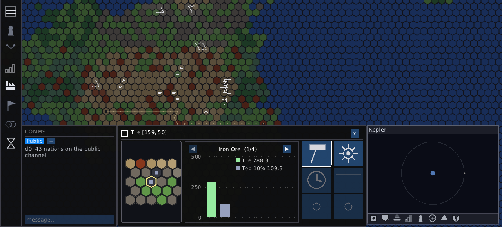

---

## You are not a nation — you are a company

No borders on the map. No standing army. No capital to defend. A balance sheet, a few
buildings on one crowded planet — and a solar system you can see from day one and cannot
yet reach.

---

## 01 · The premise

Most 4X games hand you a country and ask you to grow it. Project Io hands you a
**corporation chartered under someone else's flag**, on an Earth-like world that is already
carved up, already industrialised, already busy. Twenty-one nations were here first. You buy in.

**You exist while you own something.** One building keeps the company alive. There is no
throne to lose — which also means there is nothing to hide behind. Bankruptcy and seizure are
the two ways out.

**Every asset argues for itself.** Wages, maintenance and interest come out every tick. A mine
that can't clear its own costs isn't a setback, it's a hole you are choosing to keep digging.

**Nobody gets a special rule.** Rival corporations run on the same simulation you do — same
prices, same wages, same depletion curves. No hidden bonuses, no difficulty tax.

---

## 02 · The world argues before it draws

A new campaign doesn't roll a map. It runs a planet's history and lets the map fall out of it —
where liquid water survived, whether life started, how long it had, what that left in the rocks.
You steer it, one question per stage.

Oxygen arriving early leaves a world *iron-rich and coal-lean*. Arriving late flips it. Then
plates drift, continents assemble, and the deposits land where the geology says they should.
**The terrain is an argument, not a texture.**

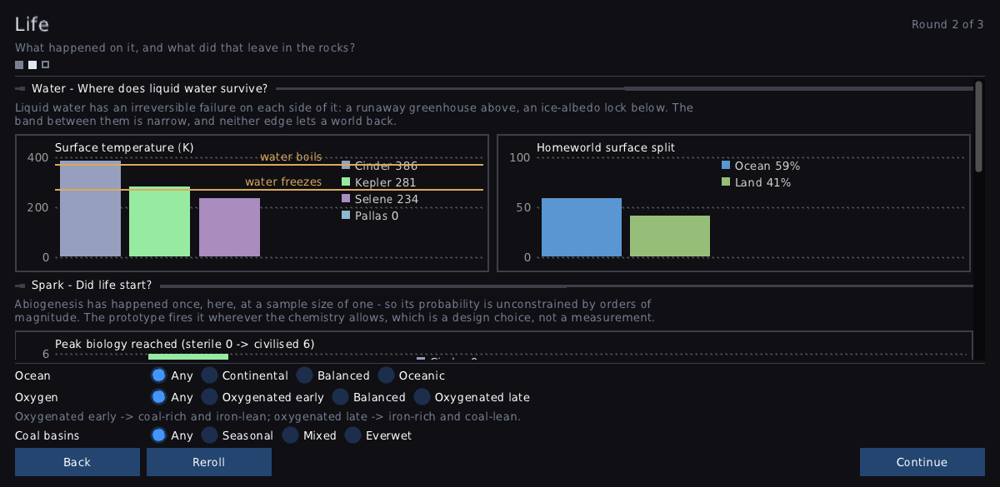

*Stage 2 of 3 — Life. The bands where water survives, the split of ocean to land, and the
choice that decides whether your homeworld runs on iron or on coal.*

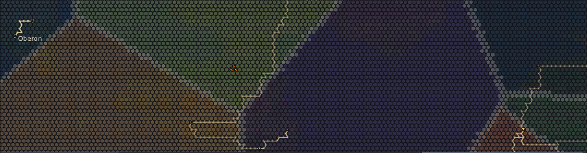

*The plates, kept. The same tectonics that shaped the coastline stay queryable afterwards —
mountain runs and rifts sit where two plates met.*

---

## 03 · Three canvases, one ladder

The system, a planet's neighbourhood, and the ground itself are the same view at three depths.
Click a body to descend. Click the minimap to climb. The outer planets are *on your map from the
first minute* — legible, named, and completely out of reach until you've built the industry that
earns the trip.

*Solar — Helios, its orbits, and the bodies you haven't looked at yet.*

*Circumplanetary — one planet and what orbits it: Kepler, and the moon Selene.*

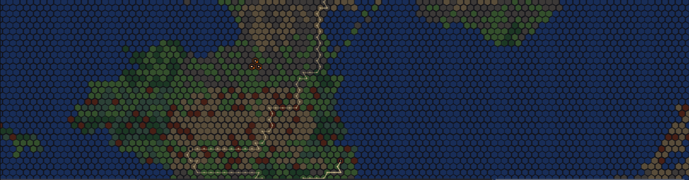

*Planetary — hex ground, terrain by composition and landform, borders and all.*

---

## 04 · One map, six questions

The ground doesn't change; what you're asking it does. A lens repaints every tile against a
single question — *who owns this, who governs it, what's under it, what does it cost here, who
lives here, who is making things* — and the answer reads at a glance, at any zoom. Eight sit on
the bar. Four more come out for specific work: scarcity, industry, corporate reach, and supply
routes.

| | |
|---|---|
| 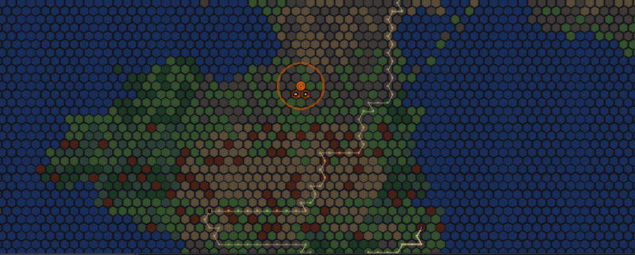 | 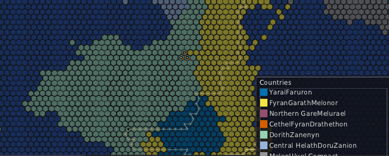 |
| **Corporation** — who holds what. Every corp gets a colour and a shape, derived from its id. | **Country** — the political carve-up you are operating inside, and negotiating with. |
| 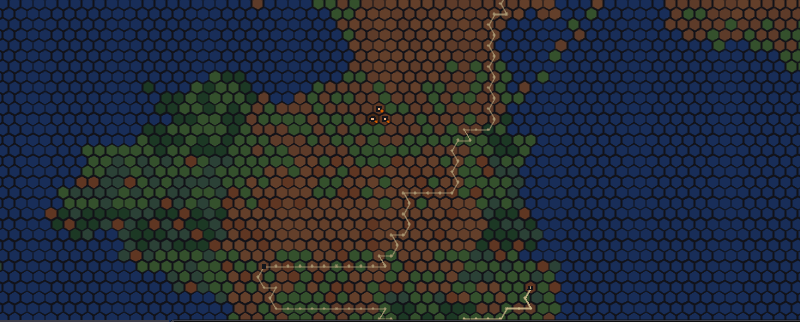 | 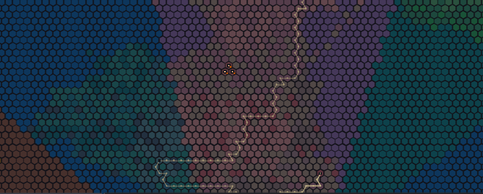 |
| **Resource** — one commodity at a time. Here iron ore, brightness scaled to what's in the ground. | **Market** — which exchange a tile actually trades into. Prices are *local*, so this line matters. |
| 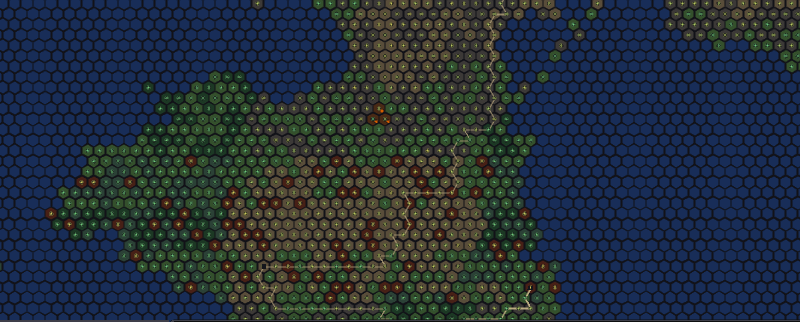 | 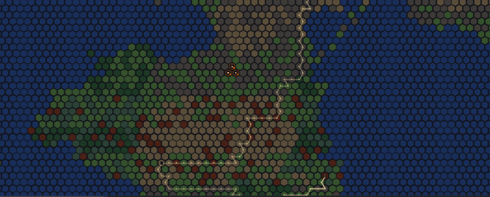 |
| **Population** — where the labour is, and therefore where wages are cheap and where they aren't. | **Production** — what is actually being made, by anyone, right now. |

---

## 05 · You only know what you paid to learn

Two fogs, and they're independent. **The ground is unsurveyed** until you fund a survey and wait
for it — tiles and deposit bands come back region by region, and until they do that body is a
rumour with an orbit.

**Commerce has its own fog.** Your trade routes and your presence light up what you can see of
other people's activity, and it goes stale when you stop looking. You can always see a rival's
buildings and the public market price. You never see their books.

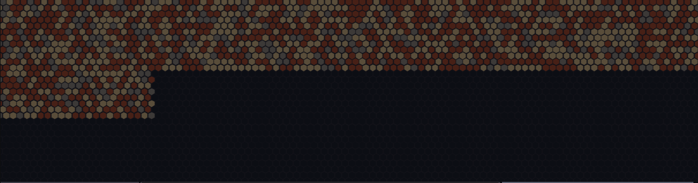

*Surveying 100 of 253. The revealed band is real terrain with real deposits. The dark is not
empty — it's unpaid for.*

*The commercial sphere — known, stale, or unknown. A read on who is doing business out there,
decaying as your attention moves elsewhere.*

---

## 06 · The money is the game

Base prices come from global rarity; what you actually get comes from local supply and demand at
the market you sell into. Each exchange clears on its own. A glut in one basin and a shortage two
borders away is not a bug to be smoothed out — *it's the trade*.

Twenty-three resources across three tiers, raw through refined to finished product. Buy low
somewhere, refine it, and sell it where the recipe that needs it is already running.

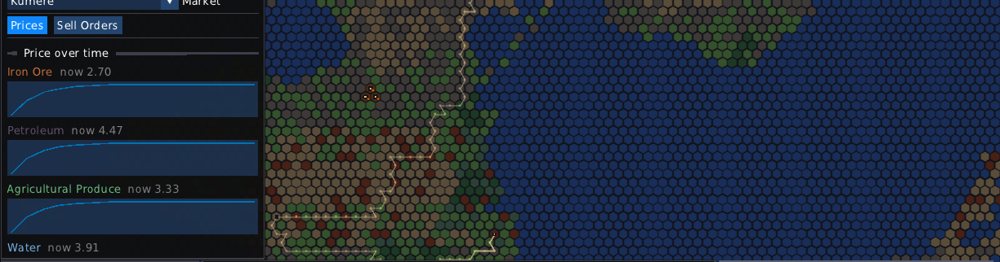

*Prices over time, per market. Iron ore 2.70, petroleum 4.47, produce 3.33, water 3.91 — at
**this** exchange, on this tick. Somewhere else they're different numbers.*

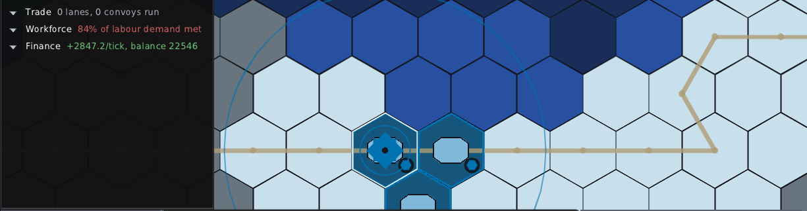

*Four rollups, one company. 3 making, 0 idle, 7349/tick — and 84% of labour demand met, which is
the sentence that explains the other three.*

---

## 07 · Put something on the ground

Arm a build and the map answers back before you commit: what this terrain permits, whether the
site *thrives*, what it will cost. Place it, and it doesn't switch on — it waits, and tells you
plainly why. `Paused — market can't supply materials` is a supply-chain problem you now own.

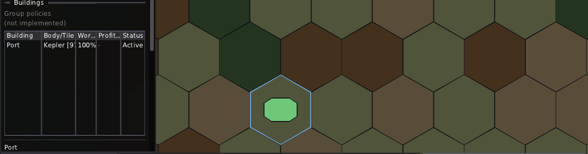

*Armed — the candidate tile, outlined, with the ghost of what you're about to owe money on.*

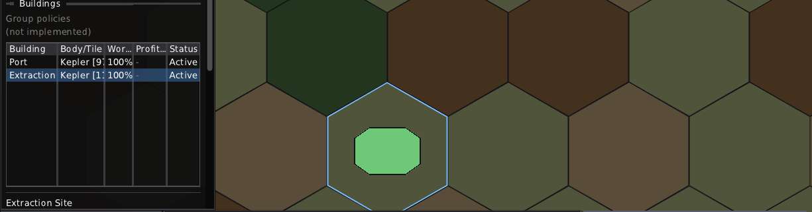

*Built, and stalled. An extraction site that can't get its inputs. The game tells you which of
those two facts to fix.*

---

## 08 · Eras — the gear shifts

The loop never changes: buy, sell, build, contest. What changes is what the loop is *about*.
There's no end screen and no victory parade — you enter the next era underprepared, and it's hard.

| | | |
|---|---|---|
| **Era 0** | *built* | **Terrestrial** — a Cold War footing on a saturated homeworld. Buy land, build chains, raise private force. This era is about earning the right to leave, and it ends in a rupture, not a graduation. |
| **Era 1** | *next* | **Early Space** — the launchpad fires and logistics becomes the game. Fuel is heavy, distance is expensive, supply lines are targets, and whoever makes propellant off-world stops paying Earth's prices. |
| **Era 2** | *ahead* | **Dimensional** — where the game turns overtly science-fictional. The direction is set; the theme is still being argued out. |
| **Era 3** | *ahead* | **Megastructure** — swarms, stations and belt-scale mining, as tools you wield, capped and nerfed on purpose. Scarcity loosens, and the question shifts from what to extract to what to build with it. |

---

## 09 · Where it actually is

A working prototype, not a mock-up. One person, C++20 with Lua on top, no engine. Everything
above is running code you can start from this screen:

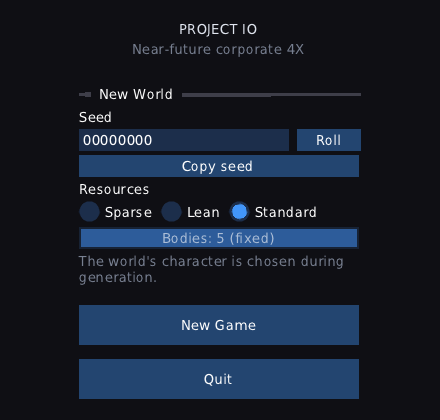

*Seeded and deterministic. Copy the seed, send it to someone, get the same solar system.*

| | | | | | |
|---|---|---|---|---|---|
| **v0.0.9** | **165** | **37k** | **302** | **84** | **1** |
| shipped | items delivered | lines of C++ | golden captures | design documents | developer |

**Every screenshot on this page is a regression test.** The game screenshots itself headlessly
and compares the pixels — which is why they all look like this, and why they're honest.

---

Project Io · prototype · v0.0.9 shipped, v0.1.0 in progress · C++20 · SDL3 · Lua 5.4 · Dear ImGui

A styled standalone version of this page lives in [`index.html`](index.html) — one self-contained
file, no external requests. Download it and open it in any browser.
